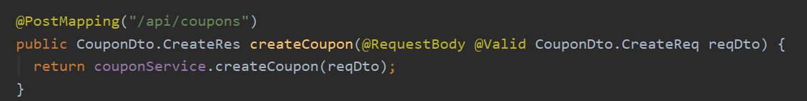

## DTO Class Code Convention

### #1.클래스 정의 방법
 - 도메인 또는 리소스 별 DTO 클래스 생성 후(CouponDto), 각 API(Controller 에 정의된 메소드: CreateReq, CreateRes) 에 해당하는 DTO를 InnerClass 로 정의
 - CouponDto의 객체 생성을 하지 않으므로 InnerClass는 static 키워드를 명시한다.

### #2.생성자의 접근자는 최소한으로
 - 객체 생성이 불필요한 클래스의 기본 생성자 접근자는 Private로 지정  
  --> 개별 DTO는 InnerClass로 정의하기 때문에 객체 생성이 불필요하다.  
 

### #3. Reqeust Dto 클래스

#### ##3-1. @NoArgsConstructor 의 접근자는 Private로 한다.
 - @RequestBody 를 사용하면 Spring 내부에서 Jackson 라이브러리를 사용하여 Deserialize (JSON 데이터와 Request 객체 사이의 변환) 을 한다.
 - 이때 기본 전략으로 Default Constructor + Reflection 을 사용한다. 이때 최소 접근자는 Private 이다.

#### ##3-2. Data Validation
 - Bean Validation에서 제공하는 @NotNull, @NotBlank, @Pattern 등을 사용하여 Request Data에 대한 오류를 최소화 한다.
 
 - 꼭 @RequestBody 옆에 @Valid 를 명시해줘야 한다.  
  
 
 
 - Validation이 실패할 경우, MethodArgumentNotValidException 의 예외가 발생한다.

(MethodArgumentNotValidException  이미지)

### #4. Response Dto 클래스

#### ##4-1. 객체 생성을 위해 필드가 3개 이상일 경우는 @Builder를 사용한다.
 - @Builder 사용 시 All Arguments Constructor 가 자동으로 생성된다.  
 
 - 생성자를 이용한 객체 생성을 막기 위해 생성자를 따로 정의한 후(@AllArgsConstructor) 접근제어자를 Private로 정의한다.  

#### ##4-2. 객체 생성을 위해 필드가 3개 이상일 경우는 @Builder를 사용한다.

#### ##4-3. @Getter 필요 이유
 - @ResponseBody 를 사용하면 Spring 내부에서 Jackson 라이브러리를 사용하여 Response 객체를 Serialize(ByteCode로 변환) 하는데 이때 getter 메소드를 사용한다.  
 - 따라서 response 객체는 @Getter 를 사용해야 한다.

## MapStruct
- DTO -> Entity, Entity -> DTO의 객체 매핑을 위한 라이브러리

### #1. gradle 추가
- 롬복과 함께 사용 시, lombok annotationProcessor 보다 mapstruct annotationProcessor가 먼저 선언이 되야 한다.
- SpringBoot 버전에 호환하는 MapStruct 버전이 존재, 해당부분 확인 필요

### #2. Mapper Interface 생성

#### ##2-1. @Mapper 사용
- 매핑 정책(Policy)과 전략(Strategy)를 설정할 수 있다.  

| 정책 | 값 | 설명 |예시|
|------|----|------|----|
| unmappedSourcePolicy | IGNORE(default), WARN, ERROR | Source의 필드가 Target에 매핑되지 않을 때 정책이다. | ERROR로 설정하면 매핑 시 Source.aField가 사용되지 않는다면 컴파일 오류가 발생시킨다. |
| unmappedTargetPolicy | IGNORE, WARN(default), ERROR | Target의 필드가 매핑되지 않을 때 정책이다. | ERROR로 설정하면 매핑 시 Target.aField에 값이 매핑되지 않는다면 컴파일 오류가 발생시킨다. |
| typeConversionPolicy | IGNORE(default), WARN, ERROR | 타입 변환 시 유실이 발생할 수 있을 때 정책이다. | ERROR로 설정하면 long에서 int로 값을 넘길 때 값에 유실이 발생할 수 있다. 이런 경우에 컴파일 오류를 발생시킨다. |

| 전략 | 값 | 설명 |
|------|----|------|
| nullValueMappingStrategy | RETURN_NULL(default), RETURN_DEFAULT | Source가 null일 때 정책이다. |
| nullValuePropertyMappingStrategy | SET_TO_NULL(default), SET_TO_DEFAULT, IGNORE | Source의 필드가 null일 때 정책이다. |

#### ##2-2. INSTANCE 생성  
- 빌드 시점에 CouponMapper 를 상속받은 CouponMapperImpl(구현체) 클래스가 생성된다.
- 따라서 이 구현체를 사용할 수 있는 객체를 생성한다.

### #3. Mapper 사용

#### #3-1. Dto to Entity 또는 Entity to Dto 선언부 생성

#### #3-2. @Getter, @Builder 설정
 - 변환과정에서 꺼내오는 객체(source)에는 Getter가 있어야 하고, 변환해서 저장하고자 하는 객체(target)에는 Builder 혹은 Setter가 있어야 하는데 Setter는 지양한다.

